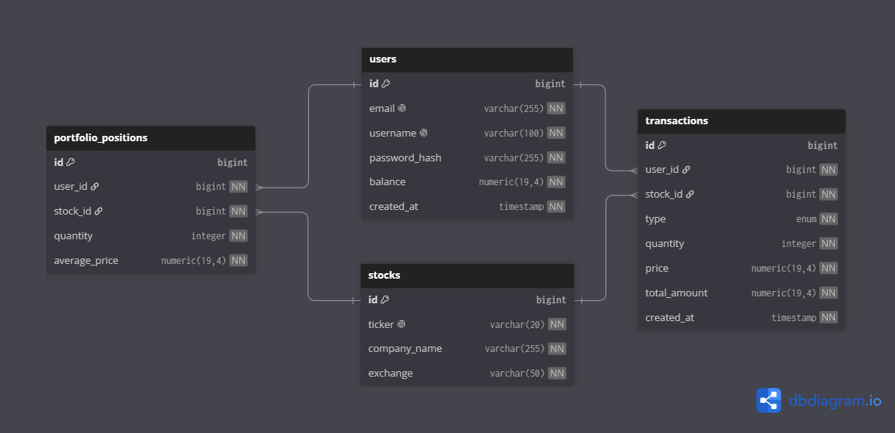

# ImiTrade

Trading-platform backend. Spring Boot 3.5 / Java 25 / PostgreSQL / Flyway.

## Modules

| Feature    | Description                                                        |
|------------|-------------------------------------------------------------------|
| `auth`     | Registration (`POST /api/v1/auth/register`), login (`POST /api/v1/auth/login`) |
| `user`     | Current-user profile (`GET /api/v1/users/me`)                     |
| `security` | Stateless JWT auth, BCrypt, Spring Security 6 filter chain         |
| `common`   | Shared error envelope, exception handling                          |
| `stocks`   | Read-only catalog: `GET /api/v1/stocks` (paginated, ticker/companyName filters), `GET /api/v1/stocks/{id}` |
| `trading`  | Buy/sell: `POST /api/v1/trades/buy`, `POST /api/v1/trades/sell`     |
| `portfolio`| Current holdings + live PnL: `GET /api/v1/portfolio`               |
| `account`  | Account summary (main screen): `GET /api/v1/account`               |

## Authentication model

- **Stateless** — no HTTP sessions (`SessionCreationPolicy.STATELESS`).
- **BCrypt** password hashing (`BCryptPasswordEncoder`).
- **JWT (HS256)** issued on register/login; claims: `sub` = userId, `email`.
- `/api/v1/auth/**` and Swagger endpoints are **public**; everything else
  requires a valid `Authorization: Bearer <jwt>` header.
- Invalid/missing token → `401` with a JSON body (`code = UNAUTHENTICATED`).
- Bad credentials or unknown user → `401` (`code = INVALID_CREDENTIALS`)
  — login never reveals whether an e-mail is registered.
- Duplicate email/username → `409` (`EMAIL_ALREADY_EXISTS` / `USERNAME_ALREADY_EXISTS`).

### Initial balance

Every newly registered user starts with **500000.00** virtual money
(`UserService.INITIAL_BALANCE`), per business rule.

### Configuration (`application.yaml`)

```yaml
app:
  security:
    jwt:
      secret-key: ${APP_JWT_SECRET:<base64-key>}   # override in production!
      access-token-ttl: ${APP_JWT_TTL:86400000}    # ms (24h by default)
      issuer: imitrade
```

## Trading & Portfolio

### Stocks

Six MOEX blue-chip stocks (SBER, GAZP, LKOH, ROSN, NVTK, YDEX) are seeded by
Flyway and read-only — `current_price` is kept in sync with MOEX by the
market-data scheduler and drives all buy/sell trades.

### Buy (`POST /api/v1/trades/buy`)

1. Validates `quantity` > 0.
2. Checks user balance ≥ `current_price` × `quantity`.
3. Appends a **BUY** transaction.
4. Upserts the portfolio position — **weighted-average price**:
   `(oldQty × oldAvg + buyQty × price) / (oldQty + buyQty)`.
5. Debits balance.

### Sell (`POST /api/v1/trades/sell`)

1. Validates `quantity` > 0.
2. Checks a position exists for the stock + enough shares.
3. Appends a **SELL** transaction.
4. Decrements position quantity; deletes the position when quantity reaches 0.
5. Credits balance.

### Portfolio (`GET /api/v1/portfolio`)

Read-only view of current holdings. **Unrealized PnL** is computed per request:

```
PnL = (currentPrice − averagePrice) × quantity    scale 4, HALF_UP
```

PnL is never persisted — it is recalculated from live `current_price` on every
call. An empty portfolio returns `200 []`.

### Account (`GET /api/v1/account`)

Read-only account summary used as the application's main screen. Returns the
authenticated user's balance plus live portfolio aggregates, all computed in
memory from current holdings and live `current_price` (never persisted):

```
portfolioValue = Σ(currentPrice × quantity)              scale 4, HALF_UP
profitLoss     = Σ((currentPrice − averagePrice) × quantity) scale 4, HALF_UP
totalAssets    = balance + portfolioValue                scale 4, HALF_UP
positionsCount = number of current portfolio_positions
```

An empty portfolio yields `portfolioValue = 0`, `profitLoss = 0`,
`totalAssets = balance`, `positionsCount = 0`.

```json
{
  "username": "arseny",
  "email": "arseny@example.com",
  "balance": 12500.50,
  "portfolioValue": 8423.30,
  "totalAssets": 20923.80,
  "profitLoss": 312.45,
  "positionsCount": 4
}
```

## Run

```bash
docker compose up -d        # PostgreSQL 17
./gradlew bootRun           # starts on :8080
```

## API (Swagger UI)

Once the app is running:

- **Swagger UI:** http://localhost:8080/swagger-ui.html
- **OpenAPI JSON:** http://localhost:8080/v3/api-docs

### How to verify manually

1. **Register** — `POST /api/v1/auth/register`
   ```json
   { "email": "alice@example.com", "username": "alice", "password": "S3cret!pass" }
   ```
   Response → `201` with `{ "token": "...", "type": "Bearer", "expires_in": 86400 }`.

2. **Authorize in Swagger UI** — click **Authorize**, paste the token as
   `Bearer <token>` (or just the raw token).

3. **Call a protected endpoint** — `GET /api/v1/users/me` → `200` with the
   user profile (id, email, username, balance, createdAt).

4. **Login** — `POST /api/v1/auth/login` with the same credentials → new token.

5. **Negative checks:**
   - `GET /api/v1/users/me` with no token → `401 UNAUTHENTICATED`.
   - Same call with `Authorization: Bearer garbage` → `401 UNAUTHENTICATED`.
   - `POST /api/v1/auth/login` with a wrong password → `401 INVALID_CREDENTIALS`.
   - `POST /api/v1/auth/register` with a duplicate email → `409 EMAIL_ALREADY_EXISTS`.

6. **List stocks** — `GET /api/v1/stocks` → `200` paginated list of all
   stocks with `ticker`, `companyName`, `exchange`, `currentPrice`.

7. **Buy stock** — `POST /api/v1/trades/buy`
   ```json
   { "stockId": 1, "quantity": 5 }
   ```
   Response → `200` with `{ "transactionId", "stockTicker", "type": "BUY", "quantity", "price", "totalAmount" }`.

8. **View portfolio** — `GET /api/v1/portfolio` → `200` with positions
   including `averagePrice`, `currentPrice`, and computed `pnl`.

9. **View account summary** — `GET /api/v1/account` → `200` with `username`,
   `email`, `balance`, `portfolioValue`, `totalAssets`, `profitLoss`,
   `positionsCount` (computed live from current holdings).

9. **Sell stock** — `POST /api/v1/trades/sell`
   ```json
   { "stockId": 1, "quantity": 3 }
   ```
   Response → `200` with a `SELL` trade response.

10. **Negative: insufficient balance** — `POST /api/v1/trades/buy` with a
    quantity whose total exceeds the remaining balance → `400 INSUFFICIENT_BALANCE`.

## Tests

```bash
./gradlew test
```

| Suite                    | Type         | Coverage                                                                 |
|--------------------------|--------------|--------------------------------------------------------------------------|
| `JwtServiceTest`         | Unit         | Round-trip, tampered/expired/wrong-key/wrong-issuer/garbage tokens       |
| `UserServiceTest`        | Unit         | Register rules, BCrypt hashing, initial balance, not-found               |
| `AuthServiceTest`        | Unit         | Register/login happy path, bad password, unknown user, conflict         |
| `AuthIntegrationTest`    | Integration  | Register/login via MockMvc + H2, duplicate email/username, hashing, 400 |
| `SecurityAccessTest`     | Security     | Public/protected matrix, 401 without/with-invalid JWT, 200 with JWT      |
| `StockServiceTest`        | Unit         | Paginated listing, ticker/companyName filters, not-found                  |
| `StockRepositoryTest`    | Unit         | JPA specification queries                                                |
| `StockControllerTest`    | Unit         | MockMvc stock endpoints                                                   |
| `StockSecurityTest`       | Security     | Stock endpoints require JWT                                               |
| `TradeServiceTest`        | Unit         | Buy/sell happy path, all error branches                                   |
| `TradeIntegrationTest`    | Integration  | Buy/sell via MockMvc + PostgreSQL (Testcontainers)                        |
| `TradeSecurityTest`       | Security     | Trade endpoints require JWT                                               |
| `PortfolioPositionRepositoryTest` | Unit | `findByUserId`, `findByUserIdAndStockId`                       |
| `PortfolioServiceTest`    | Unit         | PnL computation, empty portfolio                                          |
| `PortfolioControllerTest` | Unit         | MockMvc portfolio endpoint                                                |
| `PortfolioIntegrationTest` | Integration | Full buy → portfolio read flow (Testcontainers)                            |
| `PortfolioSecurityTest`   | Security     | Portfolio endpoint requires JWT                                           |
| `AccountServiceTest`      | Unit         | portfolioValue/totalAssets/profitLoss/positionsCount, empty portfolio      |
| `AccountControllerTest`   | Unit         | MockMvc account endpoint                                                   |
| `AccountSecurityTest`     | Security     | Account endpoint requires JWT                                              |

Integration/security tests use the **real security layer** (no mocking) and an
**in-memory H2** (PostgreSQL compatibility mode) via the `test` profile.

---


